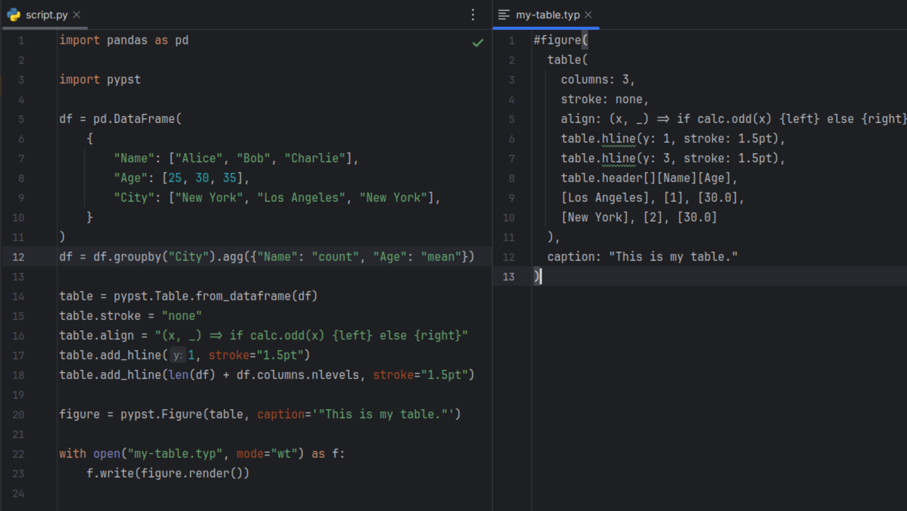

# Pypst

Declarative Typst in Python with Pandas data frame support.

Pypst helps you dynamically generate [Typst](https://typst.app) code directly in Python. No manual string manipulation required.
It has two major use cases:

- Generating full Typst documents to be rendered as PDFs
- Generating and styling Typst tables from Pandas data frames to be included in another Typst document

Pypst produces human-readable Typst code that you can modify and extend.
It will not compile Typst code for you, but you can either use the [Typst compiler](https://github.com/typst/typst/releases) to do so in the command line or install the [Typst Python package](https://pypi.org/project/typst/).



## Installation

Pypst is available on PyPI and can be installed via pip.

```bash
pip install pypst
```

## Usage

Pypst contains classes that represent Typst elements.
You can create a Typst document by instantiating these classes and nesting them as needed.

```pycon
>>> import pypst
>>> heading = pypst.Heading("My Heading", level=1)
>>> itemize = pypst.Itemize(["First item", "Second item", "Third item"])

```

Each of these classes has a `render` method that returns the Typst code as a string.

```pycon
>>> print(heading.render())
= My Heading
>>> print(itemize.render())
- First item
- Second item
- Third item

```

If you want to combine multiple elements into a single document, you can use the `Document` class.
You can even add imports for other Typst files or packages.

```pycon
>>> document = pypst.Document([heading, itemize])
>>> document.add_import("utils.typ")
>>> print(document.render())
#import "utils.typ"
<BLANKLINE>
= My Heading
<BLANKLINE>
- First item
- Second item
- Third item

```

The output of the `render` method can be written to a `.typ` file for compilation.
The [documentation](https://krokotsch.eu/pypst) contains more extensive tutorials on generating [documents](https://krokotsch.eu/pypst/usage) and generating [tables from Pandas data frames](https://krokotsch.eu/pypst/pandas).

## Limitations

Pypst is not a Typst compiler.
It doesn't check for syntax errors or compile Typst code into PDFs.
Pypst interprets any string as a Typst literal, so `stroke = "1pt"` will be rendered as `stroke: 1pt`.
If you want to pass a string literal, you need to wrap it in quotes, for example, `caption = '"My Caption"'`.
When Pypst encounters a string wrapped in quotes without need, it will automatically remove them.
For a content block, you can wrap the string in brackets instead, for example, `caption = "[My content]"`.

## Roadmap

If there is time and people are interested, I would like to add the following features:

- [x] Complete table attributes (for example, `fill` is missing)
- [ ] Support automatic formating for common workflows, like automatically merging multi-level columns with mean and standard deviation
- [x] Add more Typst elements (like headings or lists) to make building more complex documents easier

## Contributing

Pull requests are welcome. For major changes, please open an issue first to discuss what you would like to change.
